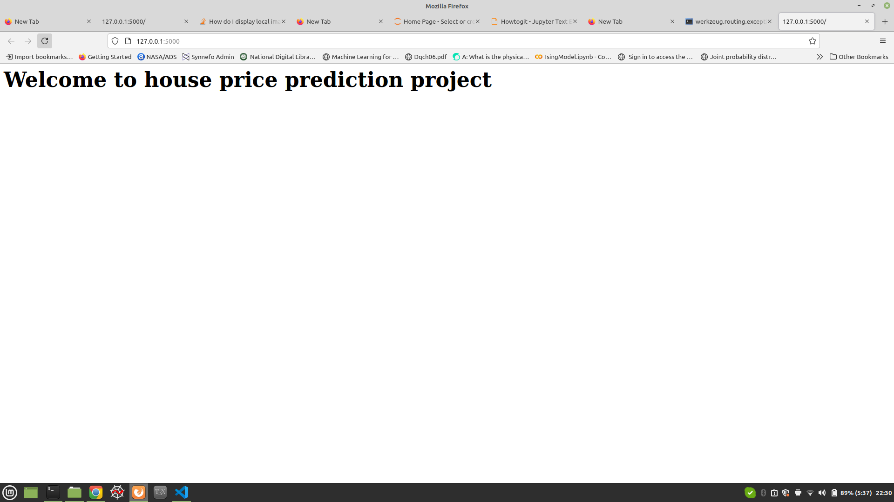
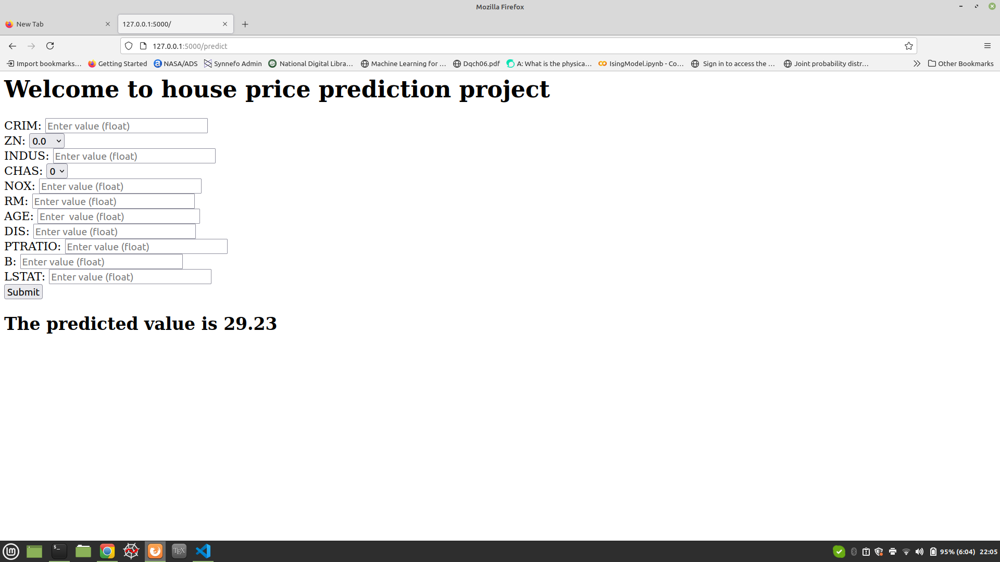

## End to End ML project 
## House Price Prediction Assignment

### 1. Create a new enviornment 
```
conda create -p venv python==3.8 -y
```
Then activate using 
```
conda activate venv/
```
### 2. Create 'requirements.txt'. 
To install any library mentioned in 'requirements.txt' do : 
```
pip install -r requirements.txt
```
### 3. Create 'setup.py'. 
To build : 
```
pip install -r requirements.txt
```
or : 
```
python setup.py install
```
This will build the package.


  **Before proceeding for the modular coding we need to have a clear idea what and how to do. For this we perform a detailed data exploration which helps us to understand the data which further helps in data modelling. All these are usually done using jupyter notebooks and are kept in a different folder `notebooks`. The data is also kept in this folder. The data exploration with various insights can be found in 'EDA.ipynb'. Next comes training the models. This is done in detailed in 'Model_training.ipynb'. We try to use libraries like 'Pipeline', 'ColumnTransformer' and do a comparitive study for different models.**


**Once these are done now we are good to go for Modular coding.**

**The module structure is shown below.**
```
.
├── setup.py
├── src
│   ├── __init__.py
│   ├── exception.py
│   ├── logger.py
│   ├── utils.py
│   ├── __pycache__
│   ├── components
│   └── pipeline
├── build
├── requirements.txt
├── artifacts
│   ├── model.pkl
│   ├── preprocessor.pkl
│   ├── raw.csv
│   ├── test.csv
│   └── train.csv
├── __pycache__
├── templates
│   ├── image1.jpeg
│   ├── index.html
│   └── home.html
├── venv
├── notebooks
│   ├── data
│   ├── EDA.ipynb
│   └── Model_training.ipynb
├── houseprice1.png
├── houseprice2.png
├── dist
├── RegressorProject.egg-info
├── image3.png
├── README.md
├── app.py
└── logs
    
```

### 4. Brief idea of the above modules. 

       - logging.py : This module help us in logging the steps and let us know if everything is going ok. 

       - exception.py : This module will catch the exception and give information of its types and location. 

       - utils.py : This module will contain the functions/methods which can be called at any point of time inside any module.  
       
       - data_ingestion.py : Here we read the data and split in train and test set. 

       - data_tranformation.py : The main purpose of this module is to transform the data, i.e. both the train and the test data. In this module, we will load the splitted data and transform it. For transformation, we identify the numerical and categorical columns and transform those seperately and create pipelines for both of them. In this project we have only numerical data. In preprocessing we need to take care of missing values, outliers and then feature scaling needs to be done. After these are done, the module will return transformed train, test data. Along with this, the preprocessing/transforming steps are saved in a pickle file. 

       - model_trainer.py : In this module we train the data using various models and the model performances are validated. 


       - training_pipeline.py : Pipeline is created to train the data. In simple words, eveything is put at one place, i.e. data ingestion is performed for the train and the test data using the `data_ingestion.py` module. Then these data are transformed using `data_transformation.py` module. Next the transformed data is trained using the `model_trainer.py` module. The evaluation report is obtained for different models.    


       - prediction_pipeline.py : This module helps to predict for the unseen data. The data input is given through a webpage and then the model prediction is performed. 
       

### 5. Deployment : 
In this we use FLASK api to deploy the code. We need to write 'app.py' module, along with templates which includes the input html page and output html page. The information from input html page will read by 'app.py' and then it will perform the training and predict the output which will be displayed at output html page. 

The web page looks like this : 

          

 

## Remaining things to be included. 
 - Tuning the parameters for the best model. 
 - Deploying the project in cloud platform.


